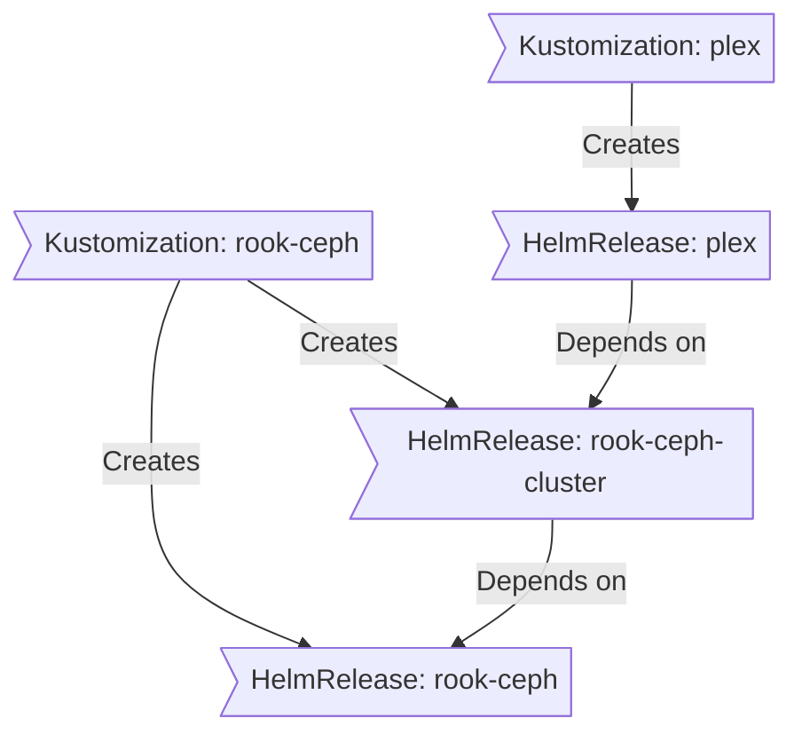

<div align="center">


## HOME OPERATIONS REPOSITORY

_Managed with Flux, Renovate, and GitHub Actions_

[](https://talos.dev)&nbsp;
[](https://kubernetes.io)&nbsp;
[](https://fluxcd.io)
[](https://github.com/bykaj/home-ops/actions/workflows/renovate.yaml)

[](https://github.com/kashalls/kromgo)&nbsp;
[](https://github.com/kashalls/kromgo)&nbsp;
[](https://github.com/kashalls/kromgo)&nbsp;
[](https://github.com/kashalls/kromgo)&nbsp;
[](https://github.com/kashalls/kromgo)&nbsp;
[](https://github.com/kashalls/kromgo)

</div>

---

<details>
<summary><strong>Table of Contents</strong> (click to expand)</summary>

1. [Overview](#-overview)
2. [Kubernetes](#-kubernetes)
    - [Core Components](#core-components)
    - [GitOps](#gitops)
    - [Folder Structure](#folder-structure)
    - [Flux Workflow](#flux-workflow)
3. [Cloud Dependencies](#-cloud-dependencies)
4. [DNS](#-dns)
5. [Hardware](#-hardware)
6. [Future Plans](#-future-plans)
7. [Gratitude and Thanks](#-gratitude-and-thanks)
8. [License](#-license)

</details>

---

##  Overview

This is a mono repository for my wildly over-engineered home infrastructure and Kubernetes cluster, because apparently I hate free time. I try to follow Infrastructure as Code (IaC) and GitOps practices using enterprise-grade tools like [Ansible](https://www.ansible.com/), [Kubernetes](https://kubernetes.io/), [Flux](https://github.com/fluxcd/flux2), [Renovate](https://github.com/renovatebot/renovate) and [GitHub Actions](https://github.com/features/actions)—you know, the same stack Netflix uses, except mine just runs my Plex server and some smart lightbulbs. Ok, I also use some trusty [bash](https://en.wikipedia.org/wiki/Bash_(Unix_shell)) scripts held together by duct tape and prayer.

---

##  Kubernetes

My Kubernetes cluster is deployed on a three [Proxmox VE](https://www.proxmox.com) node cluster with a [Talos](https://www.talos.dev) VM on every node. This is a semi-hyper-converged cluster, workloads and block storage are sharing the same available resources on my nodes while I have a separate virtualized [TrueNAS](https://www.truenas.com) server with multiple ZFS pools for NFS/SMB shares, bulk file storage and backups.

There is a template available at [onedr0p/cluster-template](https://github.com/onedr0p/cluster-template) if you want to try and follow along with some of the practices I use here.

### Core Components

- [actions-runner-controller](https://github.com/actions/actions-runner-controller): Self-hosted GitHub runners.
- [cert-manager](https://github.com/cert-manager/cert-manager): Creates SSL certificates for services in my cluster.
- [cilium](https://github.com/cilium/cilium): eBPF-based networking for my workloads.
- [cloudflared](https://github.com/cloudflare/cloudflared): Enables Cloudflare secure access to my routes.
- [external-dns](https://github.com/kubernetes-sigs/external-dns): Automatically syncs ingress DNS records to a DNS provider.
- [external-secrets](https://github.com/external-secrets/external-secrets): Managed Kubernetes secrets using [1Password Connect](https://github.com/1Password/connect).
- [flux](https://github.com/fluxcd/flux2): Syncs Kubernetes configuration in Git to the cluster.
- [kube-prometheus-stack](https://github.com/prometheus-community/helm-charts/tree/main/charts/kube-prometheus-stack): Kubernetes cluster monitoring.
- [openebs](https://github.com/openebs/openebs): Local container-attached storage for caching.
- [rook](https://github.com/rook/rook): Distributed block storage with Ceph for persistent storage.
- [sops](https://github.com/getsops/sops): Managed secrets for Kubernetes and Ansible which are commited to Git.
- [spegel](https://github.com/spegel-org/spegel): Stateless local OCI registry mirror to bypass rate limiting from container registries.
- [volsync](https://github.com/backube/volsync): Backup and recovery of persistent volume claims.

### GitOps

Flux watches the cluster in my [kubernetes](./kubernetes/) folder (see [Folder Structure](#folder-structure) below) and makes the changes to my cluster based on the state of my Git repository.

The way Flux works for me here is it will recursively search the `kubernetes/apps` folder until it finds the most top level `kustomization.yaml` per directory and then apply all the resources listed in it. That aforementioned `kustomization.yaml` will generally only have a namespace resource and one or many Flux kustomizations (`ks.yaml`). Under the control of those Flux kustomizations there will be a `HelmRelease` or other resources related to the application which will be applied.

[Renovate](https://github.com/renovatebot/renovate) watches my **entire** repository looking for dependency updates, when they are found a PR is automatically created. When some PRs are merged Flux applies the changes to my cluster.

### Folder Structure

This Git repository contains the following directories:

```sh
📁 /
├── 📁 kubernetes/
│   ├── 📁 apps/        # Application deployments (organized by namespace)
│   ├── 📁 components/  # Re-useable kustomize components
│   └── 📁 flux/        # Flux system configuration
├── 📁 talos/           # Talos cluster configuration
├── 📁 bootstrap/       # Initial cluster bootstrap (Helmfile)
└── 📁 scripts/         # Utility scripts
```

### Flux Workflow

This is a high-level look how Flux deploys my applications with dependencies. In most cases a `HelmRelease` will depend on other `HelmRelease`'s, in other cases a `Kustomization` will depend on other `Kustomization`'s, and in rare situations an app can depend on a `HelmRelease` and a `Kustomization`. The example below shows that `plex` won't be deployed or upgrade until the `rook-ceph-cluster` Helm release is installed or in a healthy state.



---

##  Cloud Dependencies

While most of my infrastructure and workloads are self-hosted I do rely upon the cloud for certain key parts of my setup. This saves me from having to worry about three things. (1) Dealing with chicken/egg scenarios, (2) services I critically need whether my cluster is online or not and (3) The "hit by a bus factor" - what happens to critical apps (e.g. Email, Password Manager, Photos) that my family and friends relies on when I'm no longer around.

Alternative solutions to the first two of these problems would be to host a Kubernetes cluster in the cloud and deploy applications like [HCVault](https://www.vaultproject.io/), [Vaultwarden](https://github.com/dani-garcia/vaultwarden), [ntfy](https://ntfy.sh/), and [Gatus](https://gatus.io/); however, maintaining another cluster and monitoring additional workloads would definitely be more work and even more costly. Something about free time...

- [1Password](https://1password.com/): Password management and Kubernetes secrets with [External Secrets](https://external-secrets.io/).
- [Cloudflare](https://www.cloudflare.com/): Public DNS and Zero Trust tunnel.
- [Fastmail](https://fastmail.com/): Email hosting.
- [GitHub](https://github.com/): Hosting this repository and continuous integration/deployments.
- [Pushover](https://pushover.net/): Kubernetes alerts and application notifications.
- [Storj](https://storj.io/): S3 object storage for applications and backups.
- [UptimeRobot](https://uptimerobot.com/): Monitoring internet connectivity and external facing applications.

---

##  DNS

In my cluster there are two instances of [ExternalDNS](https://github.com/kubernetes-sigs/external-dns) running. One for syncing private DNS records to my UniFi UDM Pro Max using [ExternalDNS webhook provider for UniFi](https://github.com/kashalls/external-dns-unifi-webhook), while another instance syncs public DNS to Cloudflare. This setup is managed by creating ingresses with two specific classes: `internal` for private DNS and `external` for public DNS. The `external-dns` instances then syncs the DNS records to their respective platforms accordingly.

---

##  Hardware

| Device                      | Num | Disks                  | RAM  | Network       | Function                |
|-----------------------------|-----|------------------------|------|---------------|-------------------------|
| Lenovo M920q, i5-8500T      | 2   | 1TB NVMe               | 64GB | 10Gb          | Proxmox VE Host         |
| Self-built 3U, i7-6700K     | 1   | 512GB SSD, 1TB NVMe, 5x14TB SATA (ZFS), 5x4TB SAS (ZFS) | 64GB | 10Gb | Proxmox VE Host, SMB/NFS + Backup Server |
| UniFi UDM Pro Max           | 1   | 8TB SATA               | -    | 10Gb          | Router & NVR            |
| UniFi USW Pro HD 24 PoE     | 1   | -                      | -    | 2.5Gb/10Gb    | PoE Core Switch         |
| UniFi USW Flex 2.5G 5       | 1   | -                      | -    | 2.5Gb         | Switch                  |
| Home Assistant Yellow       | 1   | 8GB eMMC, 256GB NVMe   | 4GB  | 1Gb           | Home Automation         |
| PiKVM V4 Plus               | 1   | 32GB eMMC              | 8GB  | 1Gb           | KVM                     |
| JetKVM                      | 3   | 8GB eMMC               | -    | 100Mb         | KVM                     |
| Eaton Ellipse Pro 650 2U    | 1   | -                      | -    | -             | UPS                     |

---

##  Future Plans

- **Upgrading to more powerful hardware** – I'm planning to replace my current Lenovo M920q units and self-built server with three [Minisforum MS-01](https://www.minisforum.com/products/minisforum-ms-01?variant=49669512429874) units as Proxmox VE hosts.
- **Building a distributed storage foundation** – The new hardware will enable me to implement Ceph distributed block storage directly on my Proxmox VE cluster, creating true high availability. My Kubernetes cluster can then leverage this same storage layer using only the `rook-ceph-operator` as an entry point, eliminating the need for separate storage components within Kubernetes.
- **Expanding network capacity** – I'll add an aggregation switch (most likely the [UniFi USW-Aggregation](https://eu.store.ui.com/eu/en/products/usw-aggregation)) since my current 10Gb SFP+ ports are at capacity. This also aligns with networking best practices.
- **Optimizing inter-node connectivity** – I'm implementing 40Gb Thunderbolt networking between cluster nodes, plus dedicated 10Gb SFP+ connections for virtualized Kubernetes nodes to the aggregation switch.
- **Dedicated NAS hardware** – TrueNAS will move from its current virtualized setup with hardware passthrough to running bare-metal on my existing 3U server.
- **Better power management** – I'll upgrade to a more powerful UPS and add a managed PDU for improved power distribution and management.

---

##  Gratitude and Thanks

A lot of inspiration for my cluster comes from the people that have shared their clusters using the [k8s-at-home](https://github.com/topics/k8s-at-home) GitHub topic. Be sure to check out the awesome [Kubesearch](http://kubesearch.dev) tool for ideas on how to deploy applications or get ideas on what you can deploy.

For learning the basics of running and maintaining a Kubernetes cluster, particularly [K3s](https://k3s.io/), I highly recommend starting with [Jim's Garage](https://youtube.com/@jims-garage) excellent [Kubernetes at Home](https://youtube.com/playlist?list=PLXHMZDvOn5sVXjb88kYXSI7UMx4rhQwOj&si=E6qRPZ915IXQYGL0) series. Once you're comfortable with the basics and ready to automate your deployments, [Techno Tim's](https://www.youtube.com/@TechnoTim) [K3s Ansible guide](https://github.com/techno-tim/k3s-ansible) provides a great foundation for automated cluster rollouts. Thanks to both [@JamesTurland](https://github.com/JamesTurland) and [@timothystewart6](https://github.com/timothystewart6) for these great resources!

And of course, shoutout to [@QNimbus](https://github.com/QNimbus) for his bash scripts that are more engineered than a Swiss watch—but hey, they actually work!

---

##  License

See [LICENSE](https://github.com/bykaj/home-ops/blob/main/LICENSE). **TL;DR**: Do with it as you please, but if it becomes sentient, you're responsible for teaching it manners.
