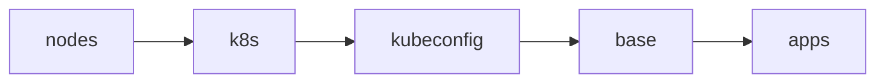

# Cluster

The entire process is driven by a single command:

```sh
just bootstrap cluster
```

Once it completes, Flux reconciles the rest of the repository and this
directory is not used again until the next rebuild.

## Stages

`just bootstrap cluster` runs these stages in order (see [mod.just](../mod.just)):



1. **nodes** - Renders each node's Talos config (`talos/*.j2` templates plus
   1Password injection) and applies it with `talosctl apply-config --insecure`.
   Nodes that are already configured are skipped, so the stage is idempotent.
2. **k8s** - Runs `talosctl bootstrap` against the controller, retrying until
   etcd reports the cluster already exists.
3. **kubeconfig** - Fetches the kubeconfig with `talosctl kubeconfig`, then
   rewrites the server address to the controller's node IP: the generated
   `https://k8s.internal:6443` points at the Cilium VIP, which does not
   exist yet. The final stage re-fetches the kubeconfig so the endpoint
   returns to `k8s.internal` once Cilium is serving it.
4. **base** - Waits for every control plane apiserver to answer `/readyz`
   and for nodes to register (they stay `Ready=False` until the CNI is
   installed), then applies:
   - `kustomize/` - bootstrap Secrets rendered through `op inject`, plus
     their namespaces: 1Password Connect credentials and token plus the
     Cloudflare tunnel ID (`manifests/`). These exist before their
     controllers so nothing deadlocks on a missing Secret.
   - `helmfile/crds.yaml` - CRDs extracted from upstream charts
     (envoy-gateway, grafana-operator, kopiur, kube-prometheus-stack) and applied
     directly. Installing CRDs out-of-band means Flux Kustomizations that
     consume CRD-backed resources don't need `dependsOn` chains.
5. **apps** - `helmfile sync` of `helmfile/apps.yaml`, the minimal release
   chain Flux needs before it can take over:

   ```text
   cilium → coredns → spegel → cert-manager → external-secrets →
   onepassword-connect → flux-operator → flux-instance
   ```

   Once `flux-instance` is healthy, Flux reconciles `kubernetes/` and manages
   these same releases from then on.

> [!TIP]
> Every stage is safe to re-run. If bootstrap fails partway, fix the issue
> and run `just bootstrap cluster` again.

## Data restore

Bootstrap itself restores no application data; that happens declaratively
once Flux takes over, via [Kopiur](https://github.com/home-operations/kopiur)
(deployed from [kubernetes/apps/system/](../../kubernetes/apps/system/),
backed by the `nas` ClusterRepository: a Kopia NFS repo on
`nas.internal`).

Apps that opt into the `kopiur/backup` component get a PVC whose
`spec.dataSourceRef` points at a Kopiur `Restore` with `target.populator: {}`
(see [kubernetes/components/kopiur/backup/](../../kubernetes/components/kopiur/backup/)).
That makes the `Restore` a
passive volume-populator source: when Flux applies the app on a fresh
cluster, the PVC is provisioned by restoring the latest snapshot for the
app's SnapshotPolicy from the repository. The PVC stays unbound while the
restore mover Job runs, so the app's pod simply stays `Pending` until the
data is back; no ordering logic needed anywhere.

Because the `Restore`s use `onMissingSnapshot: Continue`, an app with no
snapshot yet (a brand-new app, or a deliberately fresh start) comes up with
an empty volume instead of failing; the same manifests handle first deploy
and disaster recovery ("deploy-or-restore").

Each `Restore` pins the snapshot it resolved on first reconciliation and
never silently retargets, even if a schedule fires mid-restore. Expect pods
to sit `Pending` for as long as their volume takes to restore.

## Single source of truth

The helmfiles define no chart versions or values of their own. Each release's
chart and version are read from the app's `ocirepository.yaml` and its values
from the app's `helmrelease.yaml` under `kubernetes/apps/` (see
[helmfile/templates/](./helmfile/templates/)). Bootstrap therefore installs
exactly what Flux will later reconcile, and Renovate updates only one place.
