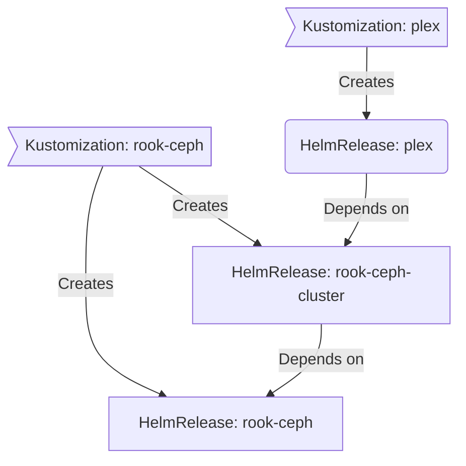

# GitOps

There is no separate deploy step. Pushing to `main` is the deploy.

## Kubernetes: Flux

Flux's top-level Kustomization, `cluster-apps`
([`kubernetes/clusters/main/apps.yaml`](https://github.com/bykaj/home-ops/blob/main/kubernetes/clusters/main/apps.yaml)),
points at `./kubernetes/apps` and recurses: it finds the top-most
`kustomization.yaml` in each namespace directory and applies what it lists.
That is usually the `Namespace` plus one Flux `Kustomization` (`ks.yaml`) per
app. Each app's `Kustomization` then applies the `HelmRelease` and related
resources from its `app/` directory.

A GitHub webhook `Receiver`
([`receiver.yaml`](https://github.com/bykaj/home-ops/blob/main/kubernetes/apps/flux-system/flux-instance/app/receiver.yaml))
triggers reconciliation on every push. After merging, verify the result. There
is no need to run `flux reconcile`.

### Cluster-wide defaults

`cluster-apps` patches every Flux `Kustomization` and `HelmRelease` it manages,
so individual apps don't repeat this boilerplate:

| Applied to | Default |
| --- | --- |
| `Kustomization` | `retryInterval: 2m`, `timeout: 15m`, `deletionPolicy: WaitForTermination` |
| `HelmRelease` install | `crds: CreateReplace`, strategy `RetryOnFailure` |
| `HelmRelease` upgrade | `crds: CreateReplace`, `cleanupOnFail`, strategy `RemediateOnFailure` (2 retries, remediate last failure) |
| `HelmRelease` | `timeout: 15m` |

A third, label-driven patch rewrites a CNPG `Cluster` to a plain `initdb`
bootstrap when its Flux Kustomization carries
`components.postgres/cnpg: init`. See [New Database](../runbooks/new-database.md).

### Dependencies

Apps declare ordering through `dependsOn`. In the example below, `plex` is not
deployed or upgraded until `rook-ceph-cluster` is healthy:

CRDs for the core operators are installed out-of-band during
[bootstrap](../runbooks/bootstrap.md), so Kustomizations that only consume
CRD-backed resources don't need `dependsOn` chains.

## NAS: doco-cd

[doco-cd](https://github.com/kimdre/doco-cd) runs on the NAS. A GitHub push
webhook triggers a deploy on every push to `main`, and it also polls `main`
every hour as a fallback (`reconciliation.interval: 3600`). It auto-discovers
stacks one directory deep under `docker/nas/` and deletes stacks whose
directory disappears. Its own stack (`00-doco-cd`) is one of them, so doco-cd
updates itself. See [Docker](../docker/index.md#webhook).

## Dependency updates: Renovate

Renovate scans the **entire** repository and opens a PR for each update it
finds: Helm charts, container images, Talos and Kubernetes versions, tools in
`.mise/config.toml`, and GitHub Actions. Configuration lives in
[`.renovaterc.json5`](https://github.com/bykaj/home-ops/blob/main/.renovaterc.json5)
and extends
[home-operations/renovate-presets](https://github.com/home-operations/renovate-presets).

Talos and Kubernetes version bumps are applied by tuppr once merged. See
[Upgrades](../runbooks/upgrades.md).
