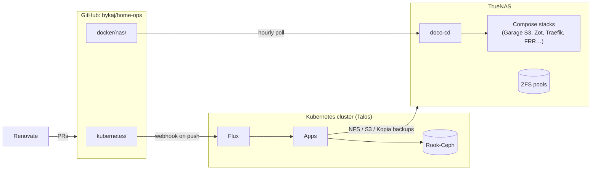

# Architecture

The platform has two halves, both driven from the same Git repository:

- **The cluster**: three Talos Linux nodes forming a semi-hyper-converged
  Kubernetes cluster. All three nodes run the control plane and workloads, and
  each contributes an NVMe drive to a Rook-Ceph cluster for block storage.
- **The NAS**: a bare-metal TrueNAS SCALE server with ZFS pools for NFS/SMB
  shares, bulk media and backups. It also runs a few Docker Compose stacks for
  services the cluster depends on, or that must survive the cluster being down
  (S3 object storage, an OCI registry mirror, PXE boot, BGP).



## Core components

| Component | Role |
| --- | --- |
| [Talos Linux](https://www.talos.dev) | Immutable, API-driven OS for the nodes |
| [Cilium](https://cilium.io) | eBPF CNI, kube-proxy replacement, BGP-announced LoadBalancer IPs |
| [Flux](https://fluxcd.io) | Reconciles `kubernetes/` into the cluster |
| [Envoy Gateway](https://gateway.envoyproxy.io) | Gateway API implementation (`envoy-internal`, `envoy-external`) |
| [cert-manager](https://cert-manager.io) | TLS certificates for the gateways |
| [external-dns](https://github.com/kubernetes-sigs/external-dns) | Split-horizon DNS: UniFi for private records, Cloudflare for public |
| [cloudflared](https://github.com/cloudflare/cloudflared) | Cloudflare Tunnel for externally published apps |
| [External Secrets](https://external-secrets.io) | Pulls secrets from 1Password Connect |
| [Rook](https://rook.io) | Ceph block storage on the nodes' Micron NVMe drives |
| [OpenEBS](https://openebs.io) | Local hostpath volumes for caches |
| [Kopiur](https://github.com/home-operations/kopiur) | PVC snapshot backups and declarative restores |
| [CloudNative-PG](https://cloudnative-pg.io) | PostgreSQL clusters per app |
| [tuppr](https://github.com/home-operations/tuppr) | Automated Talos and Kubernetes upgrades |
| [Spegel](https://spegel.dev) | Peer-to-peer OCI image mirror between nodes |
| [kube-prometheus-stack](https://github.com/prometheus-community/helm-charts) | Metrics and alerting |
| [actions-runner-controller](https://github.com/actions/actions-runner-controller) | Self-hosted GitHub Actions runners |

## Repository layout

```text
📁 /
├── 📁 .agents/          # Shared agent conventions and skills (add-app, add-docker-app)
├── 📁 ansible/          # NAS provisioning playbook and inventory
├── 📁 bootstrap/        # Cluster and NAS bring-up (helmfile, kustomize, mod.just)
├── 📁 docker/
│   └── 📁 nas/          # Compose stacks deployed by doco-cd
├── 📁 docs/             # This site
├── 📁 kubernetes/
│   ├── 📁 apps/         # Applications, organized by namespace
│   ├── 📁 clusters/     # Flux entrypoint (cluster-apps Kustomization)
│   ├── 📁 components/   # Reusable kustomize components
│   └── 📁 talos/        # Talos machine-config templates and versions
└── 📁 scripts/          # Utility scripts
```

## Further reading

- [GitOps](gitops.md): how a commit becomes cluster or NAS state
- [Secrets](secrets.md): how 1Password is wired into both halves
