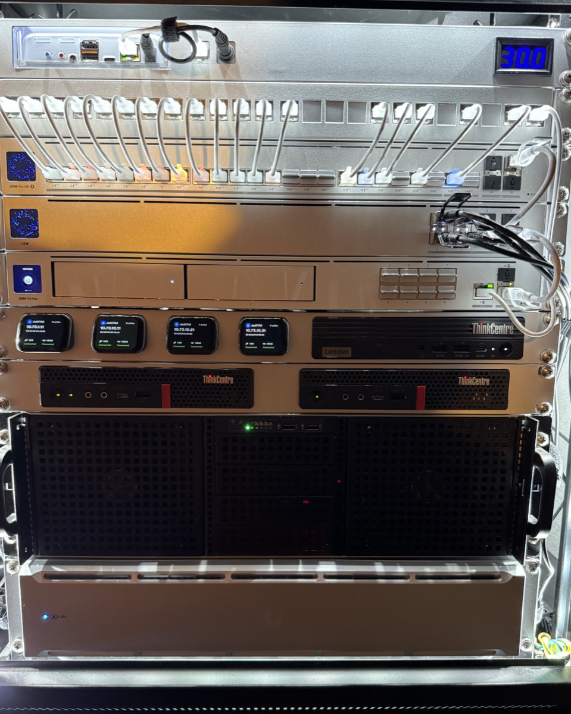

# Hardware

Everything lives in a 12U rack.

{ width="420" loading=lazy }

## Cluster nodes

Three Talos nodes. All three are control plane nodes and also run workloads.

| Node | System | CPU | RAM | Node IP |
| --- | --- | --- | --- | --- |
| `k8s-01` | Lenovo ThinkCentre M920x | i9-9900T | 64 GB | `10.73.20.10` |
| `k8s-02` | Lenovo ThinkCentre M920x | i9-9900T | 64 GB | `10.73.20.20` |
| `k8s-03` | Lenovo ThinkCentre M90q Gen 5 | i5-13400T | 64 GB | `10.73.20.30` |

Common to every node:

| Part | Model | Use |
| --- | --- | --- |
| OS disk | Kingston NV3 1 TB (NVMe) | Talos install, `EPHEMERAL` (capped at 160 GiB), `local-hostpath` user volume |
| Ceph disk | Micron 7300 PRO 480 GB (NVMe) | One Rook-Ceph OSD per node |
| NIC | Intel X520-DA2 (10G SFP+) | `bond0` (active-backup), aliased as `net0` by MAC |
| iGPU | Intel UHD | Hardware transcoding via the Intel GPU resource driver (DRA) |
| Out-of-band | JetKVM + DC Power Control Extension | Remote console and power |

!!! tip "Finding a node's hardware details"

    Each node file in
    [`kubernetes/talos/nodes/controlplane/`](https://github.com/bykaj/home-ops/tree/main/kubernetes/talos/nodes/controlplane)
    starts with a comment block listing its model, NIC MACs and drivers, and disk
    IDs. Disks are selected by model and links by MAC, not by kernel name, so
    `nvme0`/`nvme1` swapping across reboots is harmless.

## NAS

TrueNAS SCALE on a self-built 3U server.

| Part | Details |
| --- | --- |
| CPU / RAM | Intel i7-6700K, 64 GB |
| Boot | WD Red SA500 500 GB (SATA SSD) |
| Bulk pool | 6 × 14 TB Toshiba MG09 (SATA), 1 × 6-wide RAIDZ2 |
|  | 5 × 4 TB HGST Ultrastar 7K4000 (SAS), 1 × 5-wide RAIDZ1 |
| Fast pool | 2 × 1 TB Crucial MX500 (SSD), mirrored |
| NIC | Intel X520-DA2 (10G SFP+) |
| Out-of-band | JetKVM + ATX Extension Board |

## Network

| Device | Role |
| --- | --- |
| UniFi UDM Pro Max | Router, firewall, BGP peer, DNS, NVR (1 × 8 TB Seagate SkyHawk AI) |
| UniFi USW Aggregation | 10G SFP+ aggregation switch; cluster nodes and NAS |
| UniFi USW Pro HD 24 PoE | 2.5G/10G PoE++ core switch |

## Power

| Device | Role |
| --- | --- |
| UniFi UPS 2U | 1500 VA rackmount UPS, monitored by `nut-exporter` |
