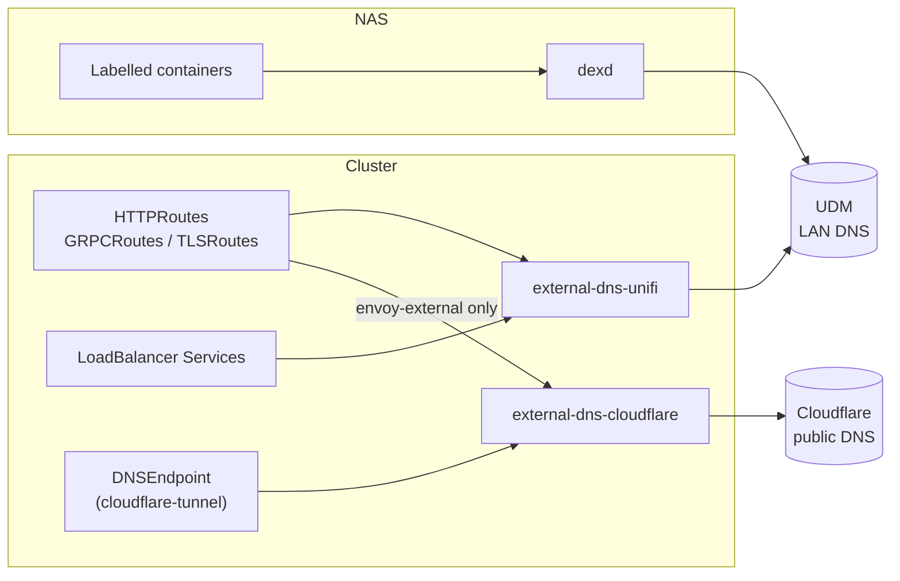

# DNS

## Overview

DNS is split-horizon. The same names resolve differently depending on where
the question comes from:

- **On the LAN**, the UDM answers. Every app resolves directly to the gateway
  it is attached to, including apps that are also published to the internet,
  so LAN traffic stays local.
- **On the internet**, Cloudflare answers. Only apps on `envoy-external` exist
  there, and they resolve to Cloudflare's proxy, which forwards them through the
  Cloudflare Tunnel.

Three controllers write the records, and a handful of records are made by hand:

| Writer | Provider | Source | Ownership TXT prefix |
| --- | --- | --- | --- |
| `external-dns-unifi` | UniFi UDM | Gateway routes and Services in the cluster | `k8s.` |
| `external-dns-cloudflare` | Cloudflare | Routes on `envoy-external`, plus `DNSEndpoint` CRDs | `k8s.` |
| [dexd](https://github.com/ishioni/dexd) | UniFi UDM | Labelled containers on the NAS | `dkr.` |
| Manual | UniFi UDM | Settings → Policy Table → DNS | — |

Both external-dns instances use `policy: sync` and `txtOwnerId: main`, so they
also delete records whose route or Service disappears, but only records they
own. They manage six zones: `bykaj.app`, `bykaj.dev`, `bykaj.io`, `cetana.id`,
`drup.lol` and `kaj.pics`.



## LAN records (UniFi)

`external-dns-unifi` uses the
[UniFi webhook provider](https://github.com/home-operations/external-dns-unifi-webhook)
and watches routes on **all** Gateways, plus Services:

| Record | Comes from | Example |
| --- | --- | --- |
| Gateway A records | `external-dns.kubernetes.io/hostname` on each Gateway's LoadBalancer Service (set through `spec.infrastructure.annotations`) | `internal.bykaj.app → 10.73.20.110`, `external.bykaj.app → 10.73.20.120` |
| App CNAMEs | Each route's hostname, targeting its Gateway's `external-dns.kubernetes.io/target` annotation | `grafana.bykaj.app → internal.bykaj.app`, `plex.bykaj.app → external.bykaj.app` |
| Service A records | `external-dns.kubernetes.io/hostname` on a LoadBalancer Service | `mqtt.bykaj.io → 10.73.20.202` (EMQX) |

Externally published apps therefore get a LAN record too, pointing at
`envoy-external`'s LoadBalancer IP. Inside the house, they skip Cloudflare,
unless a browser uses its own DNS over HTTPS (see
[below](#http3-discovery)).

## Public records (Cloudflare)

`external-dns-cloudflare` only watches routes attached to `envoy-external`
(`--gateway-name=envoy-external`), so internal-only apps never appear in public
DNS. Every record is created **proxied** (`--cloudflare-proxied`), so public
lookups return Cloudflare edge IPs rather than anything in the house.

| Record | Comes from |
| --- | --- |
| `external.bykaj.app → <tunnel-id>.cfargotunnel.com` | The `DNSEndpoint` in [`cloudflare-tunnel/app/dnsendpoint.yaml`](https://github.com/bykaj/home-ops/blob/main/kubernetes/apps/network/cloudflare-tunnel/app/dnsendpoint.yaml) |
| `<app> → external.bykaj.app` | Each route on `envoy-external` |

cloudflared accepts every hostname in the six zones and forwards it to
`envoy-external` inside the cluster, which routes on the `Host` header.

## NAS records (dexd)

[dexd](https://github.com/ishioni/dexd) (`docker/nas/02-dexd`) watches Docker
labels on the NAS. For every container labelled `dexd.enabled: "true"`, it
creates a CNAME in UniFi from the container's Traefik `Host()` rule to the
reverse proxy:

```text
registry.bykaj.app → docker.bykaj.app → 10.73.2.100   # Traefik on the NAS
s3.bykaj.io        → docker.bykaj.app
```

`docker.bykaj.app` follows the Gateway naming (`internal.bykaj.app`,
`external.bykaj.app`): it names the entry point for the Compose stacks.

NAS services are LAN-only. dexd writes nothing to Cloudflare. See
[Docker](../docker/index.md#ingress-and-dns).

## Manual records

These live in UniFi (Settings → Policy Table → DNS) because they must exist
before the cluster or the NAS stacks do, or because nothing else owns them:

| Record | Type | Target | Purpose |
| --- | --- | --- | --- |
| `k8s.internal` | A | `10.73.20.100` | Kubernetes API (`kube-api` LoadBalancer) |
| `docker.bykaj.app` | A | `10.73.2.100` | Traefik on the NAS; target of every dexd record |
| `nas.internal`, `nas` | CNAME | `nas.home.cetana.net` | NAS (NFS server, Kopia repository) |
| `k8s-01`, `k8s-02`, `k8s-03` | CNAME | `k8s-0N.home.cetana.net` | Nodes |
| `ups.internal` | A | `10.73.0.50` | UPS |

`*.home.cetana.net` names are the UDM's own DHCP client records.

!!! note "`k8s.internal` is static on purpose"

    The `kube-api` Service carries an `external-dns.kubernetes.io/hostname:
    k8s.internal` annotation, but `.internal` is outside external-dns's domain
    filters, so it is ignored. The record has to exist before Cilium does
    anyway, during [bootstrap](../runbooks/bootstrap.md).

    The annotation is kept on purpose. If the API endpoint ever moves to a
    hostname inside one of the managed zones, changing the annotation is
    enough: `external-dns-unifi` then picks it up (the UniFi instance watches
    Services) without anyone having to remember to add it.

## HTTP/3 discovery

Envoy Gateway serves HTTP/3 (`http3: {}` in the `ClientTrafficPolicy`, UDP 443
on both LoadBalancer Services). Browsers only discover it after a first TCP
visit via `Alt-Svc`, unless DNS advertises it. dnsmasq on the UDM publishes
HTTPS (type 65) records for the gateway hostnames. The hex payload decodes to
priority 1, target `.`, `alpn="h3,h2"`. Lookups follow CNAMEs, so app hostnames
that the UDM resolves to the gateways need no records of their own.

The records are written by a [UDM boot script](udm-boot-scripts.md#http3-https-records).

!!! note "Externally published apps stay local on the LAN"

    Externally published apps (Plex, and anything else behind the Cloudflare
    tunnel) also have a LAN record on the UDM: a CNAME to `external.bykaj.app`,
    which carries the HTTPS record. LAN browsers therefore connect straight to
    the `envoy-external` gateway and never touch Cloudflare.

    The exception is a browser with its own Secure DNS (DNS over HTTPS) turned
    on. It bypasses the UDM, gets Cloudflare's public answer, and rides the
    tunnel. In-cluster clients resolve through CoreDNS and the UDM, so they
    stay local too. Only Gatus, which deliberately resolves through 1.1.1.1 to
    test the public path, goes through Cloudflare.

To check which path a request took, follow the `envoy-external` access log
while opening the app:

```sh
kubectl -n network logs -l gateway.envoyproxy.io/owning-gateway-name=envoy-external -c envoy -f --since=1s \
  | grep --line-buffered '"plex.bykaj.app"' \
  | jq -c '{client: .downstream_remote_address, xff: ."x-forwarded-for", proto: .protocol}'
```

A LAN `client` address with no cloudflared pod IP in `xff` means the request
went direct. Your public IP as `client`, with a cloudflared pod in `xff`, means
it came through the tunnel.

Verify with the commands below. Query the type as `TYPE65`: older dig
releases (including the 9.10 bundled with macOS) don't know `HTTPS` and silently
treat it as a second hostname.

```sh
dig +short @10.73.0.254 internal.bykaj.app -t TYPE65
# expect: 1 . alpn="h3,h2"                  (dig that knows HTTPS)
#     or: \# 13 00010000010006026833026832   (older dig, e.g. macOS 9.10)
curl --http3-only -sk -o /dev/null -w '%{http_version}\n' https://internal.bykaj.app/
```
