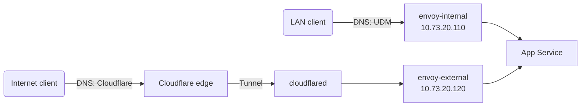

# Networking

## Addressing

| Address | What |
| --- | --- |
| `10.73.0.254` | UDM Pro Max (gateway, BGP router ID) |
| `10.73.1.10` | NAS, announced over BGP as a `/32` VIP |
| `10.73.2.100` | Traefik reverse proxy on the NAS (`proxy.bykaj.app`) |
| `10.73.20.0/24` | Servers subnet: node IPs and the Cilium LoadBalancer pool |
| `10.73.20.10` / `.20` / `.30` | `k8s-01` / `k8s-02` / `k8s-03` |
| `10.73.20.100` | `kube-api` LoadBalancer (`k8s.internal`) |
| `10.73.20.110` | `envoy-internal` Gateway (`internal.bykaj.app`) |
| `10.73.20.120` | `envoy-external` Gateway (`external.bykaj.app`) |

## Cilium

[Cilium](https://cilium.io) runs in native routing mode with full kube-proxy
replacement, DSR load balancing and BBR bandwidth management on the `bond+`
devices. LoadBalancer Service IPs come from a `CiliumLoadBalancerIPPool`
covering `10.73.20.0/24` and are announced to the UDM over BGP. See
[BGP & Load Balancing](bgp.md).

Two `CiliumCIDRGroup`s are available to network policies: `internet` (all
public IPv4 space, excluding RFC 1918 ranges) and `nas` (`10.73.1.10/32`).

## Gateways

Apps are exposed through the Gateway API, implemented by
[Envoy Gateway](https://gateway.envoyproxy.io). There are two Gateways, both
serving HTTP/3:

| Gateway | Hostname | Reached from |
| --- | --- | --- |
| `envoy-internal` | `internal.bykaj.app` | Home network only |
| `envoy-external` | `external.bykaj.app` | The internet, via the Cloudflare Tunnel |

An app picks its exposure by setting `parentRefs` on its `HTTPRoute` (the
`route` block in an app-template HelmRelease). Wildcard certificates for every
domain served (`bykaj.app`, `bykaj.dev`, `bykaj.io`, and others) are issued by
cert-manager and attached to both Gateways.

## Remote access

The [Tailscale operator](https://tailscale.com/kb/1236/kubernetes-operator)
runs two `Connector`s in the `network` namespace:

- `homelab-ingress`: an app connector routing `10.43.0.0/16` into the tailnet
- `homelab-egress`: an exit node

## Pages in this section

- [BGP & Load Balancing](bgp.md): UDM BGP peering, ECMP and flow hashing
- [DNS](dns.md): split-horizon DNS with two external-dns instances, plus HTTP/3 discovery
- [UDM Boot Scripts](udm-boot-scripts.md): persisting customizations across UDM firmware upgrades
