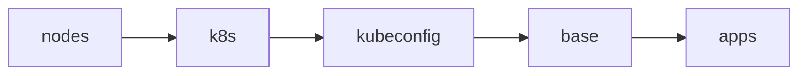

# Bootstrap

Takes freshly installed Talos nodes all the way to a self-managing Flux
cluster, and provisions a fresh TrueNAS server with its Docker stacks.
Everything is driven by
[`bootstrap/mod.just`](https://github.com/bykaj/home-ops/blob/main/bootstrap/mod.just).

## Prerequisites

- [mise](https://mise.jdx.dev) installed and activated, and `mise install` run
- A signed-in 1Password CLI (`op`). Every `op://` reference is resolved at
  apply time with `op inject`.
- A valid `talosconfig` at the repo root. The controller endpoint and node list
  are derived from `talosctl config info`, so nothing is hardcoded.
- The UDM [BGP config](../networking/bgp.md#udm-frr-config) and
  [static DNS records](../networking/dns.md#manual-records) in place.
  `k8s.internal` only works once Cilium is running, so bootstrap talks to the
  controller's node IP until then.
- Nodes booted into Talos maintenance mode, for example from a
  [Bootimus](../docker/index.md#04-bootimus) PXE boot or an ISO from
  `just talos download-image <version>`.

## Cluster

```sh
just bootstrap cluster
```



1. **nodes**: renders each node's Talos config (templates plus 1Password
   injection) and applies it with `talosctl apply-config --insecure`. Nodes
   that are already configured are skipped.
2. **k8s**: runs `talosctl bootstrap` against the controller, retrying until
   etcd reports that the cluster exists.
3. **kubeconfig**: fetches the kubeconfig and rewrites the server to the
   controller's node IP, because the generated `https://k8s.internal:6443`
   points at a Cilium VIP that doesn't exist yet.
4. **base**: waits for every apiserver to answer `/readyz` and for nodes to
   register (they stay `Ready=False` until the CNI is up), then applies:
    - `kustomize/`: bootstrap Secrets rendered through `op inject` (1Password
      Connect credentials and token, Cloudflare tunnel ID) plus their
      namespaces, so no controller deadlocks on a missing Secret
    - `helmfile/crds.yaml`: CRDs extracted from upstream charts
      (envoy-gateway, grafana-operator, kopiur, kube-prometheus-stack)
5. **apps**: `helmfile sync` of the minimal release chain Flux needs before it
   can take over:

    ```text
    cilium → coredns → spegel → cert-manager → external-secrets →
    onepassword-connect → flux-operator → flux-instance
    ```

    The kubeconfig is then fetched again, so its endpoint is back to
    `k8s.internal`.

Once `flux-instance` is healthy, Flux reconciles `kubernetes/` and manages the
same releases from then on.

!!! tip "Every stage is safe to re-run"

    If bootstrap fails partway, fix the issue and run `just bootstrap cluster`
    again.

### Single source of truth

The helmfiles define no chart versions or values of their own. Each release's
chart and version are read from the app's `ocirepository.yaml`, and its values
from the app's `helmrelease.yaml`, under `kubernetes/apps/` (see
[`bootstrap/kubernetes/helmfile/templates/`](https://github.com/bykaj/home-ops/tree/main/bootstrap/kubernetes/helmfile/templates)).
Bootstrap therefore installs exactly what Flux will reconcile later, and
Renovate only updates one place.

### Data

Bootstrap restores no application data itself. As Flux deploys each app, its
PVC is populated from the latest Kopiur snapshot, and CNPG clusters recover
from Barman. Pods stay `Pending` until their volume is restored. See
[Backups → Deploy-or-restore](../storage/backups.md#deploy-or-restore).

### Verifying

```sh
kubectl get nodes                                  # all Ready
flux get ks -A | grep -v True                      # nothing stuck
kubectl -n rook-ceph exec deploy/rook-ceph-tools -- ceph status
curl -k https://k8s.internal:6443/livez
```

## NAS

```sh
just bootstrap nas
```

This runs the Ansible playbook against the hosts in `ansible/inventory.yaml`.
It provisions TrueNAS, writes doco-cd's secrets and starts doco-cd from
`docker/nas/00-doco-cd`, which then reconciles the `docker/nas/` stacks,
including its own. Nothing in `bootstrap/` is used again until the next
provisioning.
