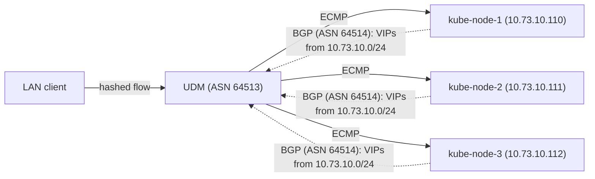
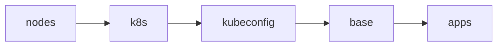

# Bootstrap

Everything needed to take freshly installed Talos nodes to a cluster that Flux
manages on its own. The entire process is driven by a single command:

```sh
just bootstrap cluster
```

Once it completes, Flux reconciles the rest of the repository and this
directory is not used again until the next rebuild.

## Prerequisites

- The [Mise](https://mise.jdx.dev/) CLI [installed](https://mise.jdx.dev/getting-started.html#installing-mise-cli) on your workstation and [activated](https://mise.jdx.dev/getting-started.html#activate-mise) in your shell.
- Tools pinned in `.mise/config.toml` installed via `mise install` (talosctl,
  just, minijinja-cli, op, yq, jq, task), plus kubectl, helmfile, kustomize and gum
  on the PATH installed with Homebrew (automatically via a mise postinstall hook).
- A signed-in 1Password CLI (`op`). Machine secrets never live in this repo; every
  `op://` reference in the Talos configs and bootstrap manifests is resolved
  at apply time with `op inject`.
- A valid `talosconfig` at the repo root (mise points `TALOSCONFIG` there).
  The justfile derives the controller endpoint and node list from
  `talosctl config info`, so nothing is hardcoded here.
- The UDM configuration below. `kube-vip.home.cetana.net` points at the Cilium
  LoadBalancer VIP, which exists only once Cilium is installed, so bootstrap
  talks to the controller's node IP directly until the `apps` stage brings
  Cilium up.

## UDM configuration

The Kubernetes API is fronted by a Cilium LoadBalancer Service (`kube-api`,
`10.73.10.10`, `externalTrafficPolicy: Local` so only nodes with a
healthy apiserver attract traffic). Cilium announces it to the UDM over BGP
along with every other LoadBalancer IP. See the
[config](../apps/kube-system/cilium/config/) folder.



The VIPs the UDM learns this way:

| VIP           | Hostname                   | Backs                          |
| ------------- | -------------------------- | ------------------------------ |
| `10.73.10.10` | `kube-vip.home.cetana.net` | `kube-api` Service (apiserver) |
| `10.73.10.12` | `internal.home.cetana.net` | `envoy-internal` Gateway       |
| `10.73.10.14` | `external.cetana.net`      | `envoy-external` Gateway       |
| `10.73.10.16` | `services.home.cetana.net` | `envoy-services` Gateway       |

A static A record in UniFi (under Settings → Policy Table → DNS, or wherever Ubiquiti decides to put it this time after a new Network release) points the API hostname at the VIP:

```text
kube-vip.home.cetana.net → 10.73.10.10
```

Cilium (ASN 64514) peers from the node IPs on the SERVERS subnet
(`10.73.10.110-112`) and announces LoadBalancer Service IPs from the
`10.73.10.0/24` pool. UniFi accepts a single FRR config upload per device
(Settings → Routing Table → BGP):

<details>
<summary>FRR config</summary>

```text
router bgp 64513
  bgp router-id 10.73.0.254
  no bgp ebgp-requires-policy

  neighbor k8s peer-group
  neighbor k8s remote-as 64514

  neighbor 10.73.10.110 peer-group k8s
  neighbor 10.73.10.111 peer-group k8s
  neighbor 10.73.10.112 peer-group k8s

  neighbor nas peer-group
  neighbor nas remote-as 64515

  neighbor 10.73.1.10 peer-group nas

  address-family ipv4 unicast
    maximum-paths 3
    neighbor k8s next-hop-self
    neighbor k8s soft-reconfiguration inbound
    neighbor nas next-hop-self
    neighbor nas soft-reconfiguration inbound
  exit-address-family
exit
```

</details>

`maximum-paths 3` gives true ECMP across the control plane nodes for the
`kube-api` VIP (FRR's eBGP default is a single best path).

> [!WARNING]
> Re-uploading the FRR config briefly bounces established BGP sessions.

To verify: `vtysh -c "show bgp summary"` on the UDM, `10.73.10.10/32`
showing an ECMP path per healthy apiserver in `vtysh -c "show ip route"`,
and `curl -k https://kube-vip.home.cetana.net:6443/livez`. In
`vtysh -c "show ip bgp 10.73.10.10"` every path should carry the
`multipath` tag; `ip route show 10.73.10.10` should list one `nexthop`
line per node (a single flat line means multipath is not installed in the
kernel).

> [!NOTE]
> `kube-vip.home.cetana.net` rides the Cilium `kube-api` LoadBalancer, so the named API
> endpoint depends on Cilium being healthy. If the CNI is ever down, reach
> the API directly at `https://10.73.10.110-112:6443` and the Talos API at
> the same node addresses; neither depends on the CNI.

## UDM boot scripts

The UDM root filesystem is an overlay: writes to `/etc` survive reboots but
are wiped by firmware upgrades, and `/run` is tmpfs. `/data` is a real
partition that survives both, so anything custom lives there as a boot
script, run by the `udm-boot` service from
[unifi-utilities/unifi-common](https://github.com/unifi-utilities/unifi-common)
(UniFi OS 4.x+):

> [!WARNING]
> Never pipe a remote script directly into your shell (bash, sh, zsh, etc.).
> Download it, read it, and only then execute it. Always. No exceptions.

```sh
curl -fsL "https://raw.githubusercontent.com/unifi-utilities/unifi-common/HEAD/remote_install.sh" | /bin/bash
```

> [!NOTE]
> The service unit itself sits on the overlay, so a firmware upgrade can
> remove it while the scripts in `/data/on_boot.d` remain.
> After an upgrade, check `systemctl is-enabled udm-boot` and rerun the
> installer if needed.

## ECMP flow hashing

The kernel default (`fib_multipath_hash_policy=0`) hashes on source and
destination IP only, so a given client always lands on the same node.
Policy `1` adds ports to the hash and spreads individual connections
across the ECMP next-hops.

<details>
<summary><code>/data/on_boot.d/30-ecmp-l4-hash.sh</code></summary>

```sh
#!/bin/sh
echo "net.ipv4.fib_multipath_hash_policy = 1" > /etc/sysctl.d/30-ecmp-l4-hash.conf
sysctl -w net.ipv4.fib_multipath_hash_policy=1
```

</details>

The `sysctl.d` drop-in covers reboots on its own; the boot script recreates
it after firmware upgrades.

> [!TIP]
> To verify spreading, run this a few times from one machine and expect the
> node in the SAN to vary:
>
> ```sh
> openssl s_client -connect kube-vip.home.cetana.net:6443 </dev/null 2>/dev/null \
>   | openssl x509 -noout -ext subjectAltName
> ```

## HTTP/3 discovery

Envoy Gateway serves HTTP/3 (`http3: {}` in the `ClientTrafficPolicy`, UDP
443 on both LoadBalancer Services), but browsers only discover it after a
first TCP visit via `Alt-Svc` unless DNS advertises it. dnsmasq on the UDM
can publish HTTPS (type 65) records for the gateway hostnames; the hex
payload decodes to priority 1, target `.`, `alpn="h3,h2"`. Lookups follow
CNAMEs, so app hostnames the UDM resolves to the gateways itself need no
records of their own.

> [!IMPORTANT]
> Externally published apps (`plex`, anything else behind the Cloudflare
> tunnel) are CNAMEs to `external.cetana.net` in public DNS, and the UDM has
> no HTTPS record for those names. The browser's HTTPS query is forwarded
> upstream, where Cloudflare answers with its own HTTPS record, and
> browsers then use that record and connect through Cloudflare, even
> though the A/AAAA answer is the internal gateway IP. LAN traffic to
> those apps rides the tunnel instead of the local path.

The main dnsmasq instance loads `--conf-dir=/run/dnsmasq.dhcp.conf.d/`,
which is tmpfs and regenerated by `ubios-udapi-server`, hence another boot
script.

<details>
<summary><code>/data/on_boot.d/40-dnsmasq-https-rr.sh</code></summary>

```sh
#!/bin/sh
CONF_DIR=/run/dnsmasq.dhcp.conf.d
for i in $(seq 1 30); do [ -d "$CONF_DIR" ] && break; sleep 2; done
[ -d "$CONF_DIR" ] || exit 0
cat > "$CONF_DIR/custom.conf" <<RR
dns-rr=external.cetana.net,65,00010000010006026833026832
dns-rr=internal.home.cetana.net,65,00010000010006026833026832
RR
[ -f /run/dnsmasq-main.pid ] && kill "$(cat /run/dnsmasq-main.pid)" 2>/dev/null
exit 0
```

</details>

Killing the main dnsmasq is safe; `ubios-udapi-server` respawns
it with the new config.

> [!NOTE]
> A provisioning event in the Network app can regenerate the conf dir and
> drop `custom.conf` until the next reboot; rerunning the script puts it
> back.

To verify:

```sh
dig +short @10.73.0.254 internal.home.cetana.net HTTPS   # expect: 1 . alpn="h3,h2"
curl --http3-only -sk -o /dev/null -w '%{http_version}\n' https://internal.home.cetana.net/
```

## Stages

`just bootstrap cluster` runs these stages in order (see [mod.just](mod.just)):



1. **nodes** - Renders each node's Talos config (`talos/*.j2` templates plus
   1Password injection) and applies it with `talosctl apply-config --insecure`.
   Nodes that are already configured are skipped, so the stage is idempotent.
2. **k8s** - Runs `talosctl bootstrap` against the controller, retrying until
   etcd reports the cluster already exists.
3. **kubeconfig** - Fetches the kubeconfig with `talosctl kubeconfig`, then
   rewrites the server address to the controller's node IP: the generated
   `https://kube-vip.home.cetana.net:6443` points at the Cilium VIP, which does not
   exist yet. The final stage re-fetches the kubeconfig so the endpoint
   returns to `kube-vip.home.cetana.net` once Cilium is serving it.
4. **base** - Waits for every control plane apiserver to answer `/readyz`
   and for nodes to register (they stay `Ready=False` until the CNI is
   installed), then applies:
   - `kustomize/` - bootstrap Secrets rendered through `op inject`, plus
     their namespaces: 1Password Connect credentials and token plus the
     Cloudflare tunnel ID (`manifests/`). These exist before their
     controllers so nothing deadlocks on a missing Secret.
   - `helmfile/crds.yaml` - CRDs extracted from upstream charts
     (envoy-gateway, grafana-operator, kopiur, kube-prometheus-stack) and applied
     directly. Installing CRDs out-of-band means Flux Kustomizations that
     consume CRD-backed resources don't need `dependsOn` chains.
5. **apps** - `helmfile sync` of `helmfile/apps.yaml`, the minimal release
   chain Flux needs before it can take over:

   ```text
   cilium → coredns → spegel → cert-manager → external-secrets →
   onepassword-connect → flux-operator → flux-instance
   ```

   Once `flux-instance` is healthy, Flux reconciles `kubernetes/` and manages
   these same releases from then on.

> [!TIP]
> Every stage is safe to re-run. If bootstrap fails partway, fix the issue
> and run `just bootstrap cluster` again.

## Data restore

Bootstrap itself restores no application data; that happens declaratively
once Flux takes over, via [Kopiur](https://github.com/home-operations/kopiur)
(deployed from [kubernetes/apps/system/](../apps/system/),
backed by the `nas`
ClusterRepository: a Kopia NFS repo on `nas.home.cetana.net`).

Apps that opt into the `kopiur/backup` component get a PVC whose
`spec.dataSourceRef` points at a Kopiur `Restore` with `target.populator: {}`
(see [kubernetes/components/kopiur/backup/](../components/kopiur/backup/)).
That makes the `Restore` a
passive volume-populator source: when Flux applies the app on a fresh
cluster, the PVC is provisioned by restoring the latest snapshot for the
app's SnapshotPolicy from the repository. The PVC stays unbound while the
restore mover Job runs, so the app's pod simply stays `Pending` until the
data is back; no ordering logic needed anywhere.

Because the `Restore`s use `onMissingSnapshot: Continue`, an app with no
snapshot yet (a brand-new app, or a deliberately fresh start) comes up with
an empty volume instead of failing; the same manifests handle first deploy
and disaster recovery ("deploy-or-restore").

Each `Restore` pins the snapshot it resolved on first reconciliation and
never silently retargets, even if a schedule fires mid-restore. Expect pods
to sit `Pending` for as long as their volume takes to restore.

## Single source of truth

The helmfiles define no chart versions or values of their own. Each release's
chart and version are read from the app's `ocirepository.yaml` and its values
from the app's `helmrelease.yaml` under `kubernetes/apps/` (see
[helmfile/templates/](helmfile/templates/)). Bootstrap therefore installs
exactly what Flux will
later reconcile, and Renovate updates only one place.
